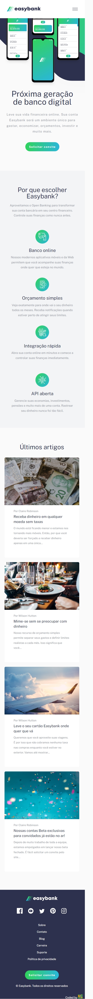

# Easybank landing page

## Índice

- [Visão Geral](#visão-geral)
  - [O Desafio](#o-desafio)
  - [Screenshot](#screenshot)
  - [Links](#links)
- [Meu processo](#meu-processo)
- [Autor](#autor)

## Visão Geral

### O Desafio

Os usuários deverão ter a capacidade de:

- Visualizar o layout ideal para o site, dependendo do tamanho da tela do dispositivo;
- Ver os estados de foco para todos os elementos interativos na página;

### Screenshot

### Links

- Site URL: [Easybank landing page](https://easybank-landing-page-rust.vercel.app/)

## Meu processo

- [x] Header
- [x] Header-states
- [x] Seção-introdução
- [x] Seção-introdução-states
- [x] Seção-sobre
- [x] Seção-blog
- [x] Seção-blog-states
- [x] Footer
- [x] Footer-states
- [x] Mobile-design

## Autor

- LinkedIn - [Fernando R Costa](https://www.linkedin.com/in/fernando-r-costa/)